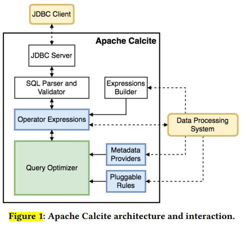
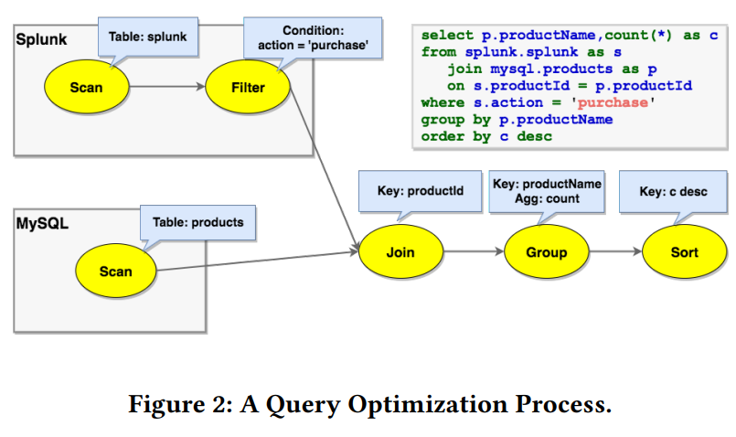
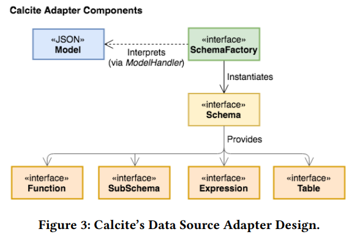

# Apache Calcite：优化异构数据源查询处理的基础框架
## 摘要
Apache Calcite是一个用于处理和优化查询的基础框架，其查询语言支持很多开源数据处理系统：Apache Hive、Apache Storm、Apache Flink、Druid、MapD等。本文内容包括：介绍Calcite，简述其历史，描述其架构、特征、功能和使用方式。Calcite的架构由查询优化器、查询处理器、adapter architecture。
- 查询优化器：模块化的、可扩展的、有大量的内置优化规则
- 查询处理器：可以处理各种查询语言
- adapter architecture：设计上支持扩展，支持异构数据模型（关系型、半结构化、流式、geospatial）和存储。

这种灵活、可嵌入和可扩展的体系结构使Calcite成为大数据框架中采用的一个有吸引力的选择。Calcite是一个活跃的项目，而且会持续引入对新型数据源、查询语言以及查询处理和优化方法的支持。
## CCS CONCEPTS
- **Information systems -> DBMS engine architectures**

## 关键字
Apache Calcite, Relational Semantics（关系语义）, Data Management（数据管理）, Query
Algebra（查询代数）, Modular Query Optimization（模块化查询优化）, Storage Adapters（存储适配器）。

## 1 简介
System R诞生之后、传统的关系型数据库主要了数据处理领域。然而，早在2005年，Stonebraker和Çetintemel就预测，我们将看到一系列专业引擎的兴起，如专栏存储、流处理引擎、文本搜索引擎等等。他们认为，特定的数据(库)引擎在专有的场景下会有更好的性能，采用关系型数据库处理的“一刀切”模式适用度将越来越低。这个观点放在今天比以往都任何时候要适用。事实上，许多专门的开源数据系统已经变得流行起来，如Storm和Flink（流处理），Elasticsearch（文本搜索）、Apache Spark、Druid等。
随着各个公司或者组织的各种量身定制的数据处理系统诞生，伴随而来的有两方面的问题：
- 这类特殊的系统开发者们已经遇到了相关的问题，比如说查询优化、或者需要支持查询SQL查询语法和相关的扩展、收到LINQ影响的语言集成查询。没有统一的框架、让负责某种数据系统的工程师在相似优化逻辑上会浪费大量的精力。
- 在技术选型的时候、往往不会是将多个特定的数据处理系统集成起来使用，一个架构可能会使用到es、spark、druid。因此、我们需要一个能够支撑异源数据的查询处理和查询优化的系统。

Apache Calcite就是用来解决以上问题的。Calcite是一个完整的查询处理系统、支持许多许多的数据管理系统的常见功能：查询执行和优化、以及查询语言，但是不包括数据存储和管理功能。Calcite诞生后，很快地被Hive、Drill、Storm和许多其他数据处理引擎所采用，为它们提供了高级的查询优化和查询语言。

此外，Calcite通过向多个系统公开公共接口实现跨平台优化。为了提高效率，优化器需要全局推理（reason globally），例如，跨不同系统做出关于物化视图选择的决策

构建一个基础框架的挑战很大。尤其是该框架需要具有足够的可扩展性和灵活性，以适应需要集成的不同类型的系统。

以下特性促成了Calcite在开源社区和行业中的广泛采用：
- **Open source friendliness**: (翻译略) Many of the major data processing platforms of the last decade have been either open source or largely based on open source. Calcite is an open-source framework, backed by the Apache Software Foundation (ASF), which provides the means to collaboratively develop the project. Furthermore, the software is written in Java making it easier to interoperate with many of the latest data processing systems that are often written themselves in Java (or in the JVM-based Scala), especially those in the Hadoop eco-system
- **Multiple data models**： Calcite同时使用流和传统数据处理范例，为查询优化和查询语言提供支持，Calcite将流式数据视为一批不存在磁盘上的时序数据。
- **Flexible query optimizer**：查询优化器是可插拔的、可扩展的，包括rules和cost model。Calcite还支持多种计划引擎。因此，优化过程可以被打散为多个阶段，每个阶段都可以选用最合适的优化引擎。
- **Cross-system support**：Calcite框架可以跨多个查询处理系统和数据库后端运行查询和优化查询
- **Reliability**： Calcite is reliable, as its wide adoption over many years has led to exhaustive testing of the platform. Calcite also contains an extensive test suite validating all components of the system including query optimizer rules and integration with backend data sources
- **Support for SQL and its extensions**：Many systems do not provide their own query language, but rather prefer to rely on existing ones such as SQL. For those, Calcite provides support for ANSI standard SQL, as well as various SQL dialects and extensions, e.g., for expressing queries on streaming or nested data. In addition, Calcite includes a driver conforming to the standard Java API (JDBC).

The remainder is organized as follows. Section 2 discusses related work. Section 3 introduces Calcite’s architecture and its main components. Section 4 describes the relational algebra at the core of Calcite. Section 5 presents Calcite’s adapters, an abstraction to define how to read external data sources. In turn, Section 6 describes Calcite’s optimizer and its main features, while Section 7 presents the extensions to handle different query processing paradigms. Section 8 provides an overview of the data processing systems already using Calcite. Section 9 discusses possible future extensions for the framework before we conclude in Section 10

## 2 RELATED WORD（主要介绍Calcite的思路来源，不翻）
虽然在Hadoop生态系统中，Calcite得到了广发的应用，但是其背后的很多想法并不是原创的。比如：查询优化器基于Volcano和Cascades的框架，并结合其他广泛使用的优化技术，如物化视图重写，还有一些和Calcite相似的系统。
Orca is一个模块化的查询优化器，在Greenplum和HAWQ之类的数据管理产品中使用，Orca将优化器与查询执行引擎进分开为不同的模块，

## 3 ARCHITECTURE
Calcite包含了许多典型的数据库管理系统模块，但是删除了一些关键的模块，比如：数据存储、数据处理的算法、存储元数据的仓库。删除这些模块的原因是：Calcite要扮演的角色是一个中介，用来连接各种数据存储以及各种数据处理引擎的中介，本身并不存储和持有数据。它也是构建定制数据处理系统的坚实基础（跨源跨库功能）。

Figure 1 中主要描述了Calcite架构的主要成员。Calcite的优化器内部采用了关系运算符树（a tree of relational operators）。优化器引擎主要由三个部分组成：rules、metadta providers、planner engine。**虚线**表示可能与外部框架有交互，与Calcite交互有两种方式：
- 第一种：Calcite包含查询解析器和校验器，可以将SQL查询翻译为一颗语法树。由于Calcite不包含存储层，因此calcite通过adapter在外部存储引擎中定义表和视图。
- 第二种：Calcite不但可优化SQL，还可以优化外部系统已有的语言解析和解释。
  - 有些系统支持SQL查询，但是没有查询优化或者是有一定的查询优化。比如Hive和Spark都有SQL，但是其内部都没有对查询进下优化。Calcite可以将优化之后的查询关系表达式重新生成为SQL，这个特性允许Calctie在所有提供SQL表达式的接口、但是没有优化的数据管理系统之上工作。
  - Calcite不仅仅可以优化SQL查询，有许多的数据处理引擎都在查询上有其专门的解析规则，Calcite同样可以对这类的查询进行优化。事实上，Calcite还允许通过直接实例化关系运算符来轻松构建运算符树。可以使用内置的关系表达式生成器接口。例如，假设我们想要使用表达式生成器来表达以下Apache Pig脚本

```
emp = LOAD 'employee_data' AS (deptno, sal);
emp_by_dept = GROUP emp by (deptno);
emp_agg = FOREACH emp_by_dept GENERATE GROUP as deptno, COUNT(emp.sql) AS c, SUM(emp.sql) as s;
dump emp_agg;

### 等效的表达式如下

final RelNode node = builder.scan("employee_data")
                            .aggregate(builder.groupKey("deptno"),
                                       builder.count(false, "c"),
                                       builder.sum(false, "s", builder.field("sal")))
                            .build();
```

这个接口表明了构建关系表达式所必需的主要构造。优化阶段完成后，应用程序可以检索优化的关系表达式，然后将其映射回系统的查询处理单元。

## 4 QUERY ALGEBRA(代数)
操作符（Operators）。Relational algebra是Calcite的核心。除开常见的数据操作符比如`filter、project、join等`，Calcite还包含了满足不同常见的操作符，能够简明地表示复杂的操作，或更有效地识别优化机会。

在OLAP系统、流式应用中通常采用窗口来定义复杂的分析函数，比如一个指标在一个事件周期或者一定行的数据中的平均变化，因此，Calcite还包含`window`操作符，`window`操作符保险上界、下界、分区等参数，聚合函数在每个`window`中执行。

特征（Traits）。Calcite没有采用不同的对象来标识实际操作符和逻辑操作符，而是才用特征描述了与运算符相关的物理特征。这些特征可以帮助优化器评估不同的方案的成本，更改特征值不会更改正在计算的逻辑表达式，即给已经生成好运算符号的行，执行逻辑不会变更。

在优化过程中，Calcite会试图在关系表达式上强制加一些特征，比如某些列的排序，关系运算符可以实现`converter`接口，该接口说明了如何将表达式的特征从一个值转换为另一个值。

Calcite有一些常见的特征，如排序、分组和分区。与SCOPE优化器类似，Calcite优化器可以对这些属性进行推理，并利用它们来找到避免不必要操作的计划。例如，如果排序运算符的输入已经正确排序，可能是因为这与后端系统中用于行的顺序相同，那么可以删除排序操作。

除了上述特征，Calcite的主要feature之一是`calling convention`特征。`calling convention`这个特征表明了表达式将会在哪里执行。将`calling convention`视为特征，让calcite可以打通不同的引擎进行数据查询。

举个栗子，想要对Mysql中`Products`表和Splunk中的`Orders`表进行join操作，可以分为一下几个步骤：
1. 扫描基于Splunk协议中的`Orders`表与基于jdbc-mysql协议的`Producets`表。数据加载在各自的引擎中，join操作是一个逻辑上的协议，没有具体实现。
2. 图2中的SQL查询包含一个过滤器（where子句），该过滤器由适配器特定的规则推入splunk。

一种可能实现是通过apache spark作为一个外部引擎：将join转为spark的实现，其输入的实现为jdbc-mysql和splunk。一种更加高效的实现是：利用Splunk可以通过ODBC对MySQL执行查找这一特点，planner规则通过`splunk-to-spark`转换器推行join操作，join操作现在处于`splunk-convention`中，在splunk引擎内部执行。


## 5 ADAPTERS
适配器（adapters）用于定义Calcite如何关联各种数据源以进行访问，图3说明了其组成部分。一般来讲，一个适配器包含一下以下几个部分：
- model: 模型是正在访问的数据源的属性
- schema: schema是定义数据源中数据的格式
- schema factory: 通过model的元数据信息产生schema
Calcite在适配器中定义的表接口，以便在执行查询时读取数据，适配器可以向执行计划中添加规则。



在第四章中我们说到，Calcite通过特征`calling convention`进行多源数据的查询操作。这些物理运算符实现了每个适配器中底层表的访问路径，当查询语句被解析为一个关系代数表达式之后，就会为这个连接下的每一个表都创建一个操作符，用于扫描表的数据，表扫描操作符是适配器必须实现的最小接口。当适配器实现了表扫描的操作符之后，Calcite的优化器就可以在客户端测的操作符中被调用：比如sorting、filtering、joins等对这些表执行任意SQL查询。

表扫描操作符中需要包含连接其对应数据源的信息，为了扩展适配器提供的功能，Calcite定义了一个枚举的`calling convention`。Relational operators with the enumerable calling convention simply operate over tuples via an iterator interface. This calling convention allows Calcite to implement operators which may not be available in each adapter’s backend.比如：`EnumerableJoin`操作符实现了join操作，通过获取查询包含的节点中的数据，然后再基于指定的字段进行join操作。

对于一些仅仅命中表中少部分数据的查询，Calcite枚举所有的操作符元组是很低效的。幸好规则相同的优化器可以用于实现适配器特定的优化规则
