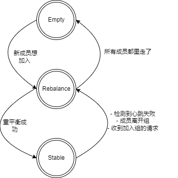

# Kafka消费者组重平衡机制
kafka topic中的数据会由消费者组中的消费者分配，每个消费者都会持有一部分分区进行数据消费，重平衡机制就是管理所有的分区，并且将分区分配给消费组内可用的消费者。

当某个消费者挂掉了，kafka需要将这个这个消费者持有的分区重新分配给剩下的消费者；新的消费者加入也与之类似，kafka会让原有的消费者们释放一些分区，将其分配给新加入的消费者，当然前提是还能倒腾出来多余的分区供其分配。

## 消费组状态
First things first， 消费者组会处于某个状态下，所有可能的状态都在GroupMetadata.class中定义（源码），配合注释，状态以及说明如下：
- Empyt - 组存在，但是没有任何消费者
- Stable - 重平衡已经完成，消费者们正拿着分配给自己的分区稳定消费
- PreparingRebalance - 在某些情况下，需要重新分配分区，kafka处在重平衡状态中
- CompletingRebalance - kafka还在重平衡消费者组，为啥重平衡有两种状态？一会讲。
- Dead - 消费者组将要被某个kafka节点移除，可能是因为节点不可用，或者是消费者组的协调者迁移了。

先不计较为什么重平衡有两个状态，暂时将这两个过程统称为重平衡过程，消费者组的状态转换流程是这样的：
    

消费者组最开始是空的，直到第一个消费者连接到这个组触发重平衡操作。当重平衡完成之后，kafka会将这个消费者组的状态切换为stable状态(稳态)；稳态下新消费者想加入kafka会再次触发这个组的重平衡过程。

当所有的消费者都离开这个组的时候，消费者组的状态切换为 Empty(空组)；

Dead状态呢？怎么触发的？Dead以外的所有状态都可以转变为Dead状态。

## 重平衡状态分析
### 为什么重平衡有两个状态
### leader的职责
### follower的职责
### 分配分区的策略
### 重平衡完成