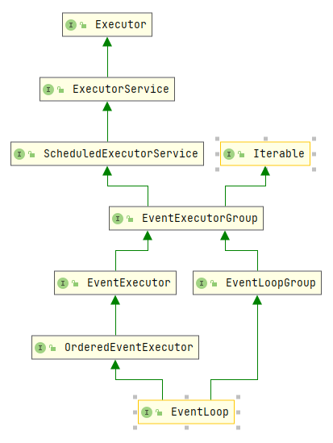

# Netty

## 1.NIO
NIO(New-IO/No-blocking IO)

### 1.NIO三大组件
### 1.1 Channel & Buffer
Channel是一个读写数据的双向通道，取别与常用的stream比如InputStream和OutputStream都是单向的，可以将Channel的数据读入Buffer，或者是将Buffer的数据写入channel，channel比stream更为底层：
- 常见的channel：
- FileChannel
- DatagramChannel
- SocketChannel
- ServerSocketChannel

Buffer是用来缓冲读写数据，常见的Buffer有：
- ByteBuffer
    - MappedByteBuffer
    - DirectByteBuffer
    - HeapByteBuffer
- ShortBuffer
- IntBuffer
- LongBuffer
- DoubleBuffer
- CharBuffer

### 1.2 Selector
古早版本服务器多线程设计

### 1.3 短连接和长连接

Selector适合连接数多，但是流量底的场景

### 1.4 零拷贝

## 2.Netty
### 2.1 概念
- channel可以理解未数据通道
- msg理解为流动的数据，最开始是ByteBuf，经过pipeline加工之后，可以变成其他类型的对象，最后输出又变成ByteBuf
- handler可以认为是数据的处理工序
  - 工序有多个，合在一起就是pipeline，pipeline负责发布事件传给每个handler，handler对自己感兴趣的事件进行处理
  - handler分为Inbound（入站）和Outbound（出站）两类
- eventLoop理解为处理数据的工人
  - 工人可以管理多个channel的io操作，并且一旦工人负责了某个channel，就要负责到底
  - 工人可以执行io操作，可以进行任务处理，每位工人有任务队列，队列里可以堆放多个channel的待处理任务，任务分为普通任务、定时任务
  - 工人按照pipeline中的顺序，依次按照handler的规划处理数据，可以为每个不同的工序指定不同的工人
  
### 2.2 EventLoop

EventLoop本质是一个单线程执行器，里面的run方法处理Channel上的数据，继承关系如图所示：

**EventLoopGroup**

EventLoopGroup是一组EventLoop

### 2.3 Channel

### 2.4 Future & Promise

### 2.5 Handler & Pipeline

### 2.6 ByteBuf

